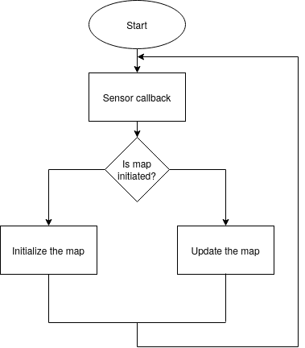

# Dynamic Occupancy grid

Considering some dynamic in the environment, occupancy grid should be able to update on it's own. This project gives a basic idea of the method used and also implementation.
## Method

Here, for dynamic environment, decaying occupancy map is used. if an area is not seen from the sensor for certain period of time then the area is considered to be free again. Decay rate can be set according to the requirement.


**Updated_map = (InverseSensorModel(New_sensor_readings)) - (old_map * decay_rate)**


## Assumptions:
- Type of sensor data used for occupancy grid generation is Laser scanner
- Dynamic objects in the environment: car and person
- Static objects are wall and box
- Dynamic environment has the constant radial velocity for simplicity. Person has 0.05 rad/frame and car has 0.1 rad/frame velocity.


## Get it running!
### Requirements
- OpenCV 
- CMake
### Build using CMake
Open the terminal and navigate to the directory where this project exists
```
mkdir build && cd build
cmake ..
make
```
Now library and the testing file is compiled and then run
```
./test_occupancy_grid
```
It will generate number of images in the same directory. Each image represents new sensor callback.
Also there are some images which are already generated with the .gif file in the images directory.

### Build with bash script
Navigate the folder to the project and open the terminal. Then run 
```
bash run.sh
```


## Results
Set of created images from the project

In the above figures, small dynamic object in the environment is the person and another moving object is car. Other two static objects are wall and box.


Gif file created from above image. Showing how dynamic object in the environment is being updated.
